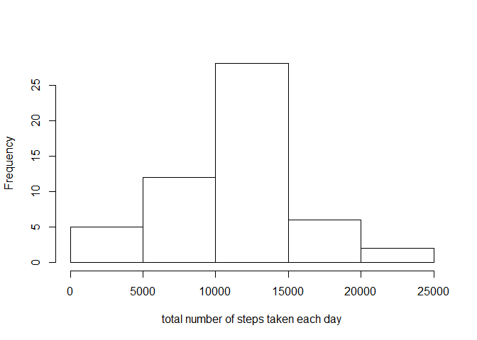
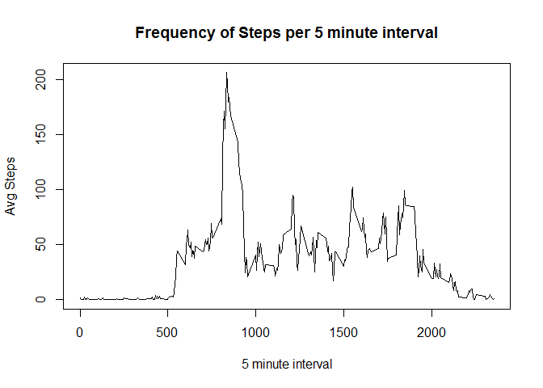

# Reproducible Research: Peer Assessment 1


## Loading and preprocessing the data

```r
data <-read.csv("activity.csv",na.strings = "NA",sep=",")
bad<- is.na(data$steps)

complete <- data[!bad,]
```


## What is mean total number of steps taken per day?

```r
library(datasets)
x <- data.frame(Category=complete$date, 
                  Frequency=complete$steps)
  xSummary <- aggregate(x$Frequency, by=list(Category=x$Category), FUN=sum)

hist(xSummary$x,xlab="total number of steps taken each day",main="")
```

 

```r
dev.off()
```

```
## null device 
##           1
```

```r
# Mean Number of steps:
mean(complete$steps)
```

```
## [1] 37.3826
```

```r
# Median Number of Steps:
median(complete$steps)
```

```
## [1] 0
```
## What is the average daily activity pattern?

```r
day_act <-data.frame(Category=complete$interval, 
                  Frequency=complete$steps)
xAvg <- aggregate(day_act$Frequency, by=list(Category=day_act$Category), FUN=mean)


 plot(xAvg$Category,
       xAvg$x,        
       type="l",
       col="black", 
       xlab="5 minute interval", 
       ylab="Avg Steps", 
       main="Frequency of Steps per 5 minute interval")
```

 

```r
  dev.off()
```

```
## null device 
##           1
```

```r
hold<- xAvg[which.max(xAvg$x), ]

#interval with max steps:
hold$Category
```

```
## [1] 835
```
## Imputing missing values

```r
#Number of Missing Values:
print(nrow(data[bad,]))
```

```
## [1] 2304
```

```r
data2 <- data.frame()
data3 <- data.frame()
idb<- c(1:17)
val <- mean(complete$steps)
for(n in idb){
if(is.na(data[n,1])){
  
  data2[n,1]<-val
  data2[n,2] <-data[n,2]
  data2[n,3] <- data[n,3]
}
  
 else{
   data2[n,1]<-data[n,1]
  data2[n,2] <-data[n,2]
  data2[n,3] <- data[n,3]
}

}
names(data2) <-c("steps", "date","interval")
data<-data2

head(data)
```

```
##     steps       date interval
## 1 37.3826 2012-10-01        0
## 2 37.3826 2012-10-01        5
## 3 37.3826 2012-10-01       10
## 4 37.3826 2012-10-01       15
## 5 37.3826 2012-10-01       20
## 6 37.3826 2012-10-01       25
```

## Are there differences in activity patterns between weekdays and weekends?
